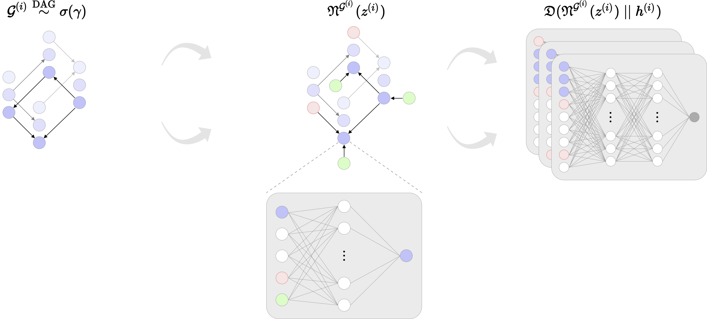

This repository is part of the thesis project **Training Neural Causal Models With Adversarial Training** (2022).

The code contains an implementation of the causal discovery technique proposed as part of the project. It allows you to train a generative model known as a **neural causal model (NCM)**. The NCM is backed by a **soft adjacency matrix** of edge beliefs, which (ideally) converge to the edges of the true causal graph underlying the dataset on which the model is trained.

The model can be run from the command line like so:

```
python3 code/run.py --structure CHAIN --num_nodes 4 --type LINEAR
```

This runs the model on a dataset constructed by a randomly generated **structural causal model (SCM)** with a chain graph structure, four nodes, and linear functional relationships. These parameters can be adjusted as follows:

* `structure`: `CHAIN`, `COLLIDER`, `BIDIAG`, `TREE`, `JUNGLE`, `FULL`, `ER1`, `ER2`
* `type`: `LINEAR`, `NONLINEAR`
* `num_nodes`: Any integer greater than or equal to 2
* `batch_size`: The batch size used during training. Default: `256`
* `num_epochs`: The number of epochs to train for. Default: `max(500, 100*num_nodes)`

Once the model has been trained, a directory containing relevant plots and a summary will be saved to disk.
